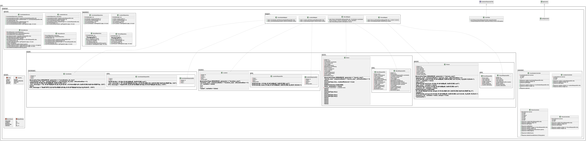

## 1.Текст задания

Внимание! У разных вариантов разный текст задания!
Реализовать информационную систему, которая позволяет взаимодействовать с объектами класса Movie, описание которого приведено ниже:
```
public class Movie {
private Long id; //Поле не может быть null, Значение поля должно быть больше 0, Значение этого поля должно быть уникальным, Значение этого поля должно генерироваться автоматически
private String name; //Поле не может быть null, Строка не может быть пустой
private Coordinates coordinates; //Поле не может быть null
private java.time.LocalDate creationDate; //Поле не может быть null, Значение этого поля должно генерироваться автоматически
private int oscarsCount; //Значение поля должно быть больше 0
private Double budget; //Значение поля должно быть больше 0, Поле может быть null
private Integer totalBoxOffice; //Поле может быть null, Значение поля должно быть больше 0
private MpaaRating mpaaRating; //Поле может быть null
private Person director; //Поле не может быть null
private Person screenwriter;
private Person operator; //Поле не может быть null
private int length; //Значение поля должно быть больше 0
private long goldenPalmCount; //Значение поля должно быть больше 0
private int usaBoxOffice; //Значение поля должно быть больше 0
private String tagline; //Поле не может быть null
private MovieGenre genre; //Поле не может быть null
}
public class Coordinates {
private Float x; //Значение поля должно быть больше -335, Поле не может быть null
private Integer y; //Максимальное значение поля: 878, Поле не может быть null
}
public class Person {
private String name; //Поле не может быть null, Строка не может быть пустой
private Color eyeColor; //Поле может быть null
private Color hairColor; //Поле не может быть null
private Location location; //Поле не может быть null
private int weight; //Значение поля должно быть больше 0
private String passportID; //Поле не может быть null
private Country nationality; //Поле может быть null
}
public class Location {
private Float x; //Поле не может быть null
private int y;
private Integer z; //Поле не может быть null
private String name; //Строка не может быть пустой, Поле не может быть null
}
public enum MpaaRating {
G,
PG,
PG_13,
R,
NC_17;
}
public enum MovieGenre {
WESTERN,
COMEDY,
MUSICAL,
ADVENTURE,
FANTASY;
}
public enum Color {
GREEN,
BLACK,
YELLOW,
BROWN;
}
public enum Country {
RUSSIA,
UNITED_KINGDOM,
VATICAN,
ITALY;
}
```
Разработанная система должна удовлетворять следующим требованиям:

Основное назначение информационной системы - управление объектами, созданными на основе заданного в варианте класса.
Необходимо, чтобы с помощью системы можно было выполнить следующие операции с объектами: создание нового объекта, получение информации об объекте по ИД, обновление объекта (модификация его атрибутов), удаление объекта. Операции должны осуществляться в отдельных окнах (интерфейсах) приложения.При получении информации об объекте класса должна также выводиться информация о связанных с ним объектах.
При создании объекта класса необходимо дать пользователю возможность связать новый объект с объектами вспомогательных классов, которые могут быть связаны с созданным объектом и уже есть в системе.
Выполнение операций по управлению объектами должно осуществляться на серверной части (не на клиенте), изменения должны синхронизироваться с базой данных.
На главном экране системы должен выводиться список текущих объетов в виде таблицы (каждый атрибут объекта - отдельная колонка в таблице). При отображении таблицы должна использоваться пагинация (если все объекты не помещаются на одном экране).
Нужно обеспечить возможность фильтровать/сортировать строки таблицы, которые показывают объекты (по значениям любой из строковых колонок). Фильтрация элементов должна производиться только по полному совпадению.
Переход к обновлению (модификации) объекта должен быть возможен из таблицы с общим списком объектов и из области с визуализацией объекта (при ее реализации).
При добавлении/удалении/изменении объекта, он должен автоматически появиться/исчезнуть/измениться в интерфейсах у других пользователей, авторизованных в системе.
Если при удалении объекта с ним связан другой объект, операция должна быть отменена, пользователю нужно сообщить о невозможности удаления объекта.
Пользователи должны иметь возможность просмотра всех объектов. Для модификации объекта должно открываться отдельное диалоговое окно. При вводе некорректных значений в поля объекта должны появляться информативные сообщения о соответствующих ошибках.
В системе должен быть реализован отдельный пользовательский интерфейс для выполнения специальных операций над объектами:

Удалить все объекты, значение поля genre которого эквивалентно заданному.
Рассчитать среднее значение поля usaBoxOffice для всех объектов.
Вернуть массив объектов, значение поля genre которых меньше заданного.
Получить список сценаристов, ни один фильм которых не получил ни одного "Оскара".
Дополнительно наградить все фильмы с продолжительностью больше заданной указанным числом "Оскаров".
Представленные операции должны быть реализованы в рамках компонентов бизнес-логики приложения без прямого использования функций и процедур БД.

Особенности хранения объектов, которые должны быть реализованы в системе:

Организовать хранение данных об объектах в реляционной СУБД (PostgreSQL). Каждый объект, с которым работает ИС, должен быть сохранен в базе данных.
Все требования к полям класса (указанные в виде комментариев к описанию классов) должны быть выполнены на уровне ORM и БД.
Для генерации поля id использовать средства базы данных.
Для подключения к БД на кафедральном сервере использовать хост pg, имя базы данных - studs, имя пользователя/пароль совпадают с таковыми для подключения к серверу.
При создании системы нужно учитывать следующие особенности организации взаимодействия с пользователем:

Система должна реагировать на некорректный пользовательский ввод, ограничивая ввод недопустимых значений и информируя пользователей о причине ошибки.
Переходы между различными логически обособленными частями системы должны осуществляться с помощью меню.
При добавлении/удалении/изменении объекта, он должен автоматически появиться/исчезнуть/измениться на области у всех других клиентов.
При разработке ИС должны учитываться следующие требования:

В качестве основы для реализации ИС необходимо использовать Java EE.
Для создания уровня хранения необходимо использовать JPA + Hibernate.
Разные уровни приложения должны быть отделены друг от друга, разные логические части ИС должны находиться в отдельных компонентах.

## 2.UML-диаграммы классов и пакетов разработанного приложения.



## 3.Исходный код системы или ссылка на репозиторий с исходным кодом.
https://github.com/listoCheck/IS-labs/tree/lab1)

## 4.Выводы по работе.
В данной лабораторной работе я научился работать с фреймворком JakartaEE, сделал на нем серверную часть моей лабораторной работы, реализовав систему работы с сущностями,
сохранял я эти сущности при помощи Hibernate и JPA. Использовал пазу данных PostgreSQL, клиентская часть приложения была написана на Vue.js.